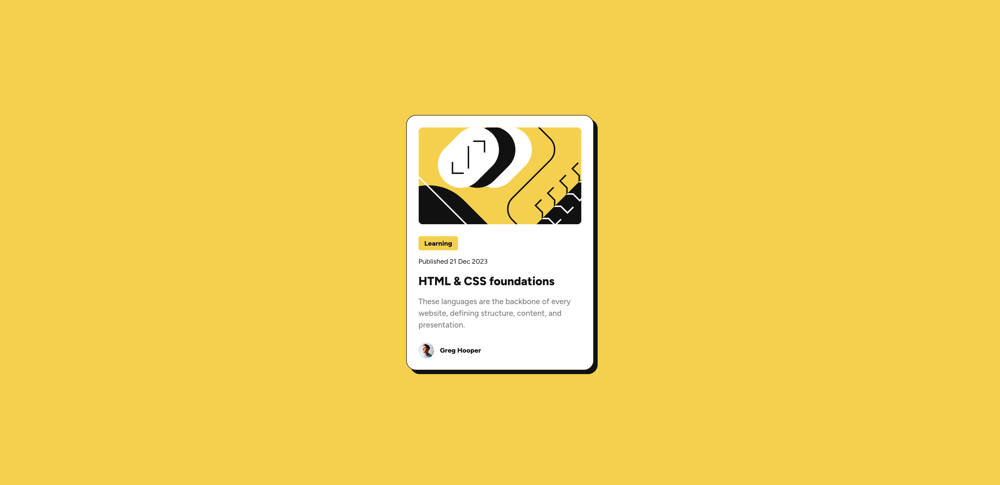

# Frontend Mentor - Blog preview card solution

This is a solution to the [Blog preview card challenge on Frontend Mentor](https://www.frontendmentor.io/challenges/blog-preview-card-ckPaj01IcS)

## Table of contents

- [Frontend Mentor - Blog preview card solution](#frontend-mentor---blog-preview-card-solution)
  - [Table of contents](#table-of-contents)
  - [Overview](#overview)
    - [The challenge](#the-challenge)
    - [Screenshot](#screenshot)
    - [Links](#links)
  - [My process](#my-process)
    - [Built with](#built-with)
    - [Features](#features)
    - [Testing and Accessibility](#testing-and-accessibility)
    - [Continued development](#continued-development)
    - [Useful resources](#useful-resources)
  - [Tools I Use](#tools-i-use)

## Overview

### The challenge

Users should be able to:

- See hover and focus states for all interactive elements on the page
- Have responsive font sizes without using `media queries`

### Screenshot

Screenshots of the project on desktop and mobile:

### Links

- Live Site URL: [Live Site](https://frontendmentor-blog-preview-card-nine.vercel.app/)

## My process

### Built with

- Semantic HTML5 markup
- CSS custom properties
- CSS `clamp()` for fluid typography
- Mobile-first workflow

### Features

- Utilizing design tokens with CSS properties
- Calculating `rem` values using `px` references: `calc(22 / 16 * 1rem)`
- Using CSS `clamp()` function for fluid typography, ensuring responsive font-size based on viewport width

### Testing and Accessibility

- Set the browser's font size on desktop to various values to ensure everything scales properly based on the user's preferred font size
- Zoomed the page in and out to check for responsiveness
- Used Firefox DevTools and ResponsivelyApp to check the website's responsiveness

### Continued development

In this challenge, I learned a lot about fluid typography. I had never used it in a real project before, but it is a neat concept to learn. I still find it hard to identify use cases for it beyond achieving responsive font sizes without the complexity of media queries.

### Useful resources

- [MDN - clamp()](https://developer.mozilla.org/en-US/docs/Web/CSS/clamp) - This helped me understand what the `clamp` function is and how to use it.
- [Linearly Scale font-size with CSS clamp() Based on the Viewport by Pedro Rodriguez](https://css-tricks.com/linearly-scale-font-size-with-css-clamp-based-on-the-viewport/) - This help me understand how to decide and calculate `preferred value` used in `clamp`
- [Modern Fluid Typography Using CSS Clamp by Adrian Bece](https://www.smashingmagazine.com/2022/01/modern-fluid-typography-css-clamp/) - This help me understand how to decide and calculate `preferred value` used in `clamp`

## Tools I Use

- [Pixel Perfect Pro by max](https://addons.mozilla.org/en-US/firefox/addon/pixel-perfect-pro/) - A Firefox extension that enables you to overlay an image over a webpage, making it easier to spot pixel differences between your result and the design
- [Fluid Typography Tool](https://fluidtypography.com/) - A website tool for finding and calculating `preferred value` in `clamp` more easily
